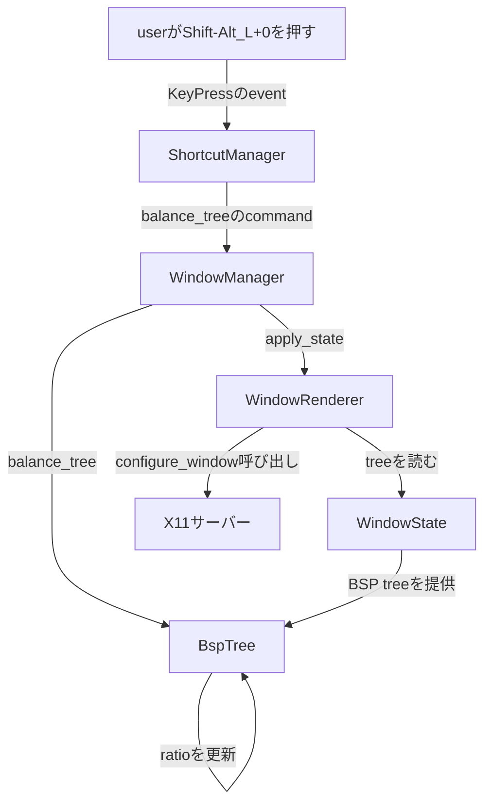
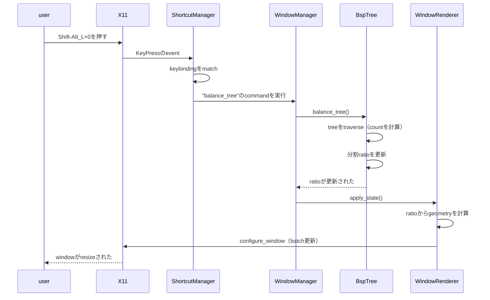
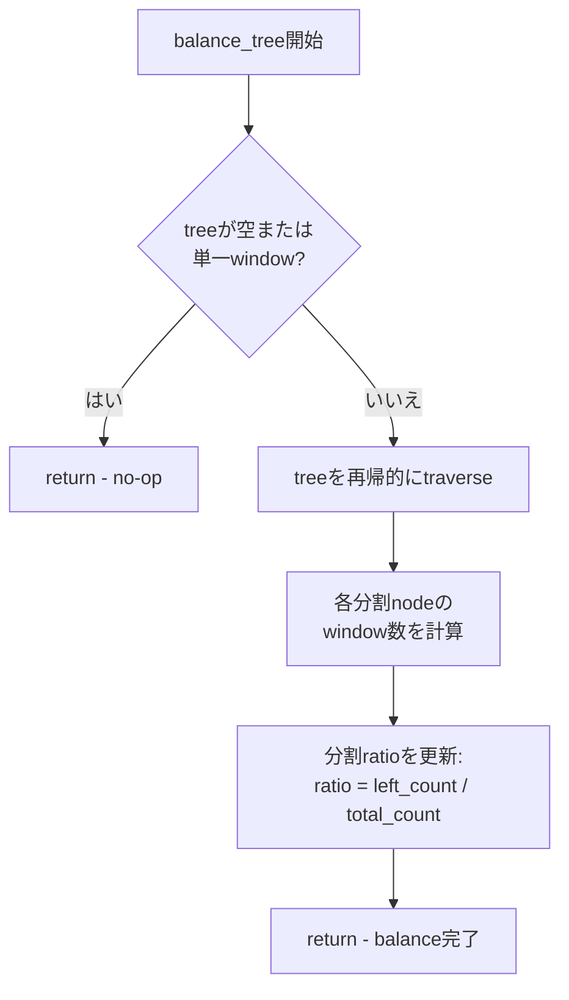

# 技術設計: BSP Balance

## 概要

この機能は、window layoutをオンデマンドで最適化したいuserに、手動BSP tree balancingのcommandを提供します。balance操作は、tree全体のwindow数分布に基づいて最適な分割ratioを計算し、完全なlayout再計算をtriggerします。

**User**: window managerのuserは、複数のwindowを追加/削除した後の迅速なlayout最適化に利用し、手動のratio調整なしで効率的な画面領域使用を確保します。

**影響**: subtreeのwindow数に基づいてすべての分割ratioを再計算する新しいwindow管理command（`balance_tree`）を追加することで、現在のBSP layoutシステムを拡張します。これは既存のcommand dispatchシステムと統合される非破壊的な追加です。

### ゴール

- 設定可能なkeybinding（例：`Shift-Alt_L+0`）でtriggerされる手動balanceのcommandの追加
- 式を使用して最適な分割ratioを計算：`ratio = left_window_count / total_window_count`
- 既存のBSP tree構造の維持（分割方向とwindow順序を保持）

### 非ゴール

- windowの追加/削除時の自動balancing（手動triggerのみ）
- balance中の分割方向やwindow順序の変更
- 比例window数を超える複雑なbalancing algorithm
- balance操作中のUIフィードバックやanimation
- 異なるbalancing戦略の設定

## アーキテクチャ

### 既存アーキテクチャ分析

Rustileは、coreデータ構造とrenderingの間にクリーンな分離を使用しています：

**BSP module**（`src/bsp.rs`）：`BspNode` enum（Split/Leaf）を持つBSP treeデータ構造を所有し、tree操作method（`add_window`、`remove_window`、`swap_windows`など）を提供します。すべてのtree操作はX11呼び出しなしで即座に戻ります。

**Window state**（`src/window_state.rs`）：BSP treeをfocus状態、fullscreen mode、および設定と集約します。Window layoutの状態の単一の真実のsourceとして機能します。

**Window renderer**（`src/window_renderer.rs`）：WindowStateをX11操作に変換します。BSP treeをtraverseして`configure_window`呼び出しを発行する`apply_state()`を含みます。

**Window manager**（`src/window_manager.rs`）：event処理とcommand dispatchを調整します。keybindingはWindowStateを変更してから`apply_state()`を呼び出すmethod呼び出しにmapされます。

**設定system**（`src/config.rs`）：検証を伴うTOMLベースの設定。keybindingはkey comboからcommand名へのmapping `HashMap<String, String>`として格納されます。

**Keybinding system**（`src/keyboard.rs`）：keybinding文字列（`"Shift-Alt_L+0"`）を解析し、X11 keycodeに変換し、左/右修飾keyの区別でKeyPressのeventを処理します。

### ハイレベルアーキテクチャ



### 技術アラインメント

この機能は、新しい依存関係を導入することなく既存のRust/X11 stackを拡張します：

**言語**：Rust（既存のcodebase標準）
**X11ライブラリ**：`x11rb`（すべてのwindow操作に既に使用）
**設定**：`serde`および`toml` crateを介したTOML（既存の設定system）
**Logging**：`tracing` crate（既存のlogging infrastructure）

**必要な新しいmethod**：
- `BspTree::balance_tree()` - `src/bsp.rs`のcore balancing algorithm
- `WindowManager::balance_tree()` - `src/window_manager.rs`のcommand dispatch
- keybinding用の設定field（既存の`Config`構造体を拡張）

**統合point**：
- keybinding登録は`ShortcutManager`の既存patternに従う
- command dispatchは`WindowManager::handle_key_press()`の既存patternに従う
- window geometryの更新は既存の`WindowRenderer::apply_state()` infrastructureを使用

## システムフロー

### Balance command flow



### Balance algorithm flow



## 要件トレーサビリティ

| 要件 | 概要 | Component | Interface | Flow |
|------|------|-----------|-----------|------|
| 1.1-1.5 | 手動balanceのcommand | BspTree, WindowManager | `balance_tree()`, command dispatch | Balance command flow |
| 2.1-2.5 | Ratio計算 | BspTree | `balance_tree_recursive()`, `count_windows()` | Balance algorithm flow |
| 3.1-3.5 | Keybinding設定 | Config, ShortcutManager | `shortcuts` HashMap, `register_shortcuts()` | Balance command flow |
| 4.1-4.5 | Window geometryの更新 | WindowRenderer | `apply_state()`, X11 configure_window | Balance command flow |
| 5.1-5.5 | Performance | BspTree | cacheを使用した効率的なtree traversal | Balance algorithm flow |
| 6.1-6.5 | Test | Test module | `#[cfg(test)]`セクションのunit test | N/A |
| 7.1-7.5 | 後方互換性 | 全component | Public APIのsignature変更なし | N/A |

## Componentとinterface

### BSP tree domain

#### BspTree（拡張）

**責任と境界**
- **主要な責任**：BSP tree構造を管理し、balance操作を提供
- **Domain境界**：Core BSP layout algorithmのdomain
- **Data所有権**：Tree構造（`Option<BspNode>`）と分割countを所有
- **Transaction境界**：Single thread、transactionの要件なし（X11 event loopがsequenceを処理）

**依存関係**
- **Inbound**：WindowManager（`balance_tree()`を呼び出す）
- **Outbound**：なし（純粋なdata構造操作）
- **外部**：なし（外部依存関係なし）

**契約定義**

```rust
impl BspTree {
    /// window数に基づいて最適な分割ratioを計算してBSP treeをbalance
    ///
    /// treeをtraverseし、各分割nodeのratioを更新して、
    /// 左右のsubtreeのwindow数に基づいて比例的に空間を割り当てます。
    ///
    /// # 事前条件
    /// - treeは任意の状態（空、単一window、または複数window）
    ///
    /// # 事後条件
    /// - すべての分割nodeがwindow数分布に基づいて更新されたratioを持つ
    /// - 分割方向とwindow順序が保持される
    ///
    /// # 不変条件
    /// - tree構造が有効なまま（孤立nodeなし）
    /// - balance前後のwindow数が同一
    pub fn balance_tree(&mut self, layout_params: LayoutParams, screen_rect: BspRect);

    /// subtreeのnodeを再帰的にbalance
    ///
    /// 親のratio計算のためにこのsubtreeのwindow数を返します。
    fn balance_tree_recursive(
        node: &mut BspNode
    ) -> usize;
}
```

**状態管理**
- **状態model**：Stateless操作 - 既存のtreeをin-placeで変更
- **永続性**：永続性なし（treeは一時的、再起動時に再作成）
- **並行性**：該当なし（single thread X11 event loop）

**統合戦略**
- **変更approach**：新しいpublic methodで既存の`BspTree`実装を拡張
- **後方互換性**：既存のmethod signatureへの変更なし、新しいmethodは純粋に追加
- **移行path**：移行不要（機能はkeybindingを介したopt-in）

### Window管理domain

#### WindowManager（拡張）

**責任と境界**
- **主要な責任**：BalanceのcommandをBspTreeにdispatchし、再renderingをtrigger
- **Domain境界**：Command orchestration層
- **Data所有権**：BspTreeを含むWindowStateを所有
- **Transaction境界**：単一のcommand実行（balance + rendering）

**依存関係**
- **Inbound**：ShortcutManager（keybinding match経由）
- **Outbound**：BspTree（balance操作）、WindowRenderer（apply_state）
- **外部**：なし

**契約定義**

```rust
impl<C: Connection> WindowManager<C> {
    /// BSP treeをbalanceし、更新されたlayoutを適用
    ///
    /// # エラー
    /// apply_state中にX11操作が失敗した場合にerrorを返す
    ///
    /// # 副作用
    /// - BSP treeのratioを変更
    /// - X11 configure_window呼び出しを発行
    /// - Balance操作をlog
    pub fn balance_tree(&mut self) -> Result<()>;
}
```

**統合戦略**
- **変更approach**：既存の`impl<C: Connection> WindowManager<C>` blockに新しいmethodを追加
- **後方互換性**：新しいmethod、既存のcommand handlerへの変更なし
- **移行path**：既存patternに従って`handle_key_press()`のcommand match文に追加

### 設定domain

#### Config（拡張）

**責任と境界**
- **主要な責任**：Balance keybinding設定の保存と検証
- **Domain境界**：設定管理
- **Data所有権**：Keybinding HashMapを所有
- **Transaction境界**：起動時の設定load

**依存関係**
- **Inbound**：WindowManager（起動時に設定を読む）
- **Outbound**：なし
- **外部**：TOML parser（`toml` crate）、file system

**契約定義**

**設定schema拡張**：
```toml
[shortcuts]
# 既存のshortcut
"Alt+j" = "focus_next"
"Alt+k" = "focus_prev"
# ... その他のshortcut ...

# 新しいbalance keybinding（optional - 省略した場合、機能は利用不可）
"Shift-Alt_L+0" = "balance_tree"
```

**検証rule**：
- Keybinding文字列は`ShortcutManager::parse_key_combination()`で正常に解析される必要がある
- Command値は空でない文字列である必要がある
- "balance_tree"のcommandに特別な検証は不要（dispatch logicで処理）

**統合戦略**
- **変更approach**：Code変更不要 - 既存の`HashMap<String, String>`が任意のcommandをsupport
- **後方互換性**：完全に互換 - keybindingなしのuserは通常通り動作し続ける
- **移行path**：userはconfig.tomlにkeybindingを追加して機能を有効化

## Dataモデル

### Domainモデル

**Core concept**：

**BspNode**（既存）：Window layoutを表す再帰的tree構造
- **Split**：`direction`、`ratio`、`left`、`right`子を含む
- **Leaf**：`Window` IDを含む

**LayoutParams**（既存）：Layout制約のbundle
- `gap: u32` - window間のspace

**BspRect**（既存）：Geometry計算用の画面/window矩形
- `x: i32, y: i32` - 左上位置
- `width: i32, height: i32` - 寸法

**Businessルールと不変条件**：
- 分割ratioは範囲(0.0, 1.0]内である必要がある
- Balance前後の合計window数が同一である必要がある
- Balance中に分割方向が変更されてはならない
- Window順序（depth-first traversal）が変更されてはならない

### 論理dataモデル

**BspNode拡張**：
```rust
pub enum BspNode {
    Split {
        direction: SplitDirection,
        ratio: f32,  // <-- balance中にこのfieldが更新される
        left: Box<BspNode>,
        right: Box<BspNode>,
    },
    Leaf(Window),
}
```

**Ratio計算**：
- 式：`ratio = left_window_count / (left_window_count + right_window_count)`
- Domain：`(0.0, 1.0]`（0.0を除外、1.0を含む）
- 特殊case：
  - treeが空：Splitノードなし → no-op
  - 単一window：Splitノードなし（tree = Leafのみ） → no-op
  - 注：BSP treeではSplitノードは常に左右2つの子を持つため、どのSplitノードもtotal_count >= 2

**Ratio計算の動作例**：

3 windowの場合：
```
Case 1: Vertical-Vertical (上から1, 2, 3)
Tree構造:                    Layout:
Split (ratio=0.33)          ┌─────────┐
├─ Leaf(W1)                │    1    │ 33% (1/(1+2))
└─ Split (ratio=0.5)        ├─────────┤
   ├─ Leaf(W2)              │    2    │ 33% (下の67% × 0.5)
   └─ Leaf(W3)              ├─────────┤
                             │    3    │ 33% (下の67% × 0.5)
                             └─────────┘

Case 2: Vertical-Horizontal (上1つ、下2つ横並び)
Tree構造:                    Layout:
Split (ratio=0.33)          ┌─────────┐
├─ Leaf(W1)                │    1    │ 33% (1/(1+2))
└─ Split (ratio=0.5)        ├────┬────┤
   ├─ Leaf(W2)              │ 2  │ 3  │ 67% (下を0.5で分割)
   └─ Leaf(W3)              └────┴────┘
```

4 windowの場合：
```
Case 1: バランス型 (2-2で左右分割、それぞれ上下分割)
Tree構造:                    Layout:
Split (ratio=0.5)           ┌─────┬─────┐
├─ Split (ratio=0.5)        │  1  │  3  │ 50% (上、左右それぞれ0.5)
│  ├─ Leaf(W1)              ├─────┼─────┤
│  └─ Leaf(W2)              │  2  │  4  │ 50% (下、左右それぞれ0.5)
└─ Split (ratio=0.5)        └─────┴─────┘
   ├─ Leaf(W3)
   └─ Leaf(W4)              各windowが25%ずつ (2/(2+2)=0.5で左右分割)

Case 2: アンバランス型 (1-3で左右分割)
Tree構造:                    Layout:
Split (ratio=0.25)          ┌───┬─────────┐
├─ Leaf(W1)                │   │    2    │ 上25% (右の1/(1+2))
└─ Split (ratio=0.33)       │ 1 ├─────────┤
   ├─ Leaf(W2)              │   │  3 │ 4  │ 下50% (右の下半分)
   └─ Split (ratio=0.5)     └───┴────┴────┘
      ├─ Leaf(W3)
      └─ Leaf(W4)           1が25% (1/(1+3)=0.25で左端)
                             2が25%, 3と4が25%ずつ (右75%を分割)
```

5 windowの場合：
```
Case: 混合 (左1、右4を2-2分割)
Tree構造:                    Layout:
Split (ratio=0.2)           ┌──┬──┬──┐
├─ Leaf(W1)                │  │ 3│ 5│ 40%
└─ Split (ratio=0.5)        │ 1├──┼──┤
   ├─ Split (ratio=0.5)     │  │ 2│ 4│ 40%
   │  ├─ Leaf(W2)           └──┴──┴──┘
   │  └─ Leaf(W3)
   └─ Split (ratio=0.5)     1が20% (1/(1+4)=0.2)
      ├─ Leaf(W4)           2,3,4,5が各20% (右80%を4分割)
      └─ Leaf(W5)
```

この式により、各subtreeのwindow数に比例して画面領域が配分され、最終的にすべてのwindowが等しい面積を持つようにbalanceされます。

**Tree traversal pattern**：
```
balance_tree() entry point
  └─> balance_tree_recursive(root)
       ├─> balance_tree_recursive(left) -> left_count
       ├─> balance_tree_recursive(right) -> right_count
       └─> node.ratio = left_count / (left_count + right_count)
```

## Error処理

### Error戦略

Balance操作はRustの`Result<()>`戻り値typeを使用して、`apply_state()`からのX11 errorを伝播します。Balance計算自体は失敗しません（tree構造上の純粋な計算）。

**Errorカテゴリ**：

**X11 protocol error**（5xx相当）：
- `configure_window`失敗 → errorをlog、残りのwindowで継続を試みる
- 接続切断 → event loopにerrorを伝播（再起動/終了をtrigger）

**無効な状態error**（設計により防止）：
- 空のtree → 早期return（no-op）
- 単一window → 早期return（no-op）
- 無効なratio計算 → 不可能（type systemと検証でguard）

### Error回復

**X11操作の失敗**：
```rust
// WindowRenderer::apply_state()内
for geometry in geometries {
    if let Err(e) = conn.configure_window(geometry.window, &values) {
        error!("Failed to configure window {:?}: {}", geometry.window, e);
        // 残りのwindowで継続 - 部分的な成功は完全な失敗より良い
        continue;
    }
}
```

**Balance操作の失敗**（rendering中のX11 error）：
```rust
// WindowManager::balance_tree()内
pub fn balance_tree(&mut self) -> Result<()> {
    // balance計算（失敗しない）
    self.window_state.balance_tree();

    // apply_stateはX11 errorで失敗する可能性がある
    if let Err(e) = self.window_renderer.apply_state(&mut self.conn, &mut self.window_state) {
        error!("Failed to apply balanced layout: {}", e);
        // treeのratioは既に更新済み - 将来の操作はbalanceされたratioを使用
        return Err(e);
    }

    info!("Successfully balanced tree");
    Ok(())
}
```

### 監視

**Logging戦略**：
- `info!` - Window数を含む成功したbalance操作
- `error!` - X11操作の失敗

## Test戦略

### Unit test

**BSP balance logic**（`src/bsp.rs`）：
1. `test_balance_empty_tree` - 空のtreeに対するno-opを検証
2. `test_balance_single_window` - 単一windowに対するno-opを検証
3. `test_balance_two_windows` - 等しい分割に対してratioが0.5になることを検証
4. `test_balance_three_windows_vertical` - 3 windows（vertical split: 上1、下2） → ルートratio=0.33を検証
5. `test_balance_three_windows_horizontal` - 3 windows（horizontal split: 左1、右2） → ルートratio=0.33を検証
6. `test_balance_preserves_structure` - Window数と順序が不変であることを検証

**設定**（`src/config.rs`）：
1. `test_balance_keybinding_parsing` - TOMLからのkeybinding loadを検証
2. `test_optional_keybinding` - Balance keybindingなしで設定が有効であることを検証

### 手動test

**Keybindingからbalanceまでのflow**：
1. Balance keybindingを含む設定をload（config.tomlに`"Shift-Alt_L+0" = "balance_tree"`を追加）
2. Rustileを起動
3. 複数のwindowを開く
4. Shift-Alt_L+0を押す
5. すべてのwindowが等しい面積にbalanceされることを目視確認

## Security考慮事項

**低security影響**：この機能は外部入力なしで既存のwindow dataを操作するため、securityへの影響は最小限です。

**入力検証**：
- Keybinding文字列は既存の`ShortcutManager::parse_key_combination()`で検証
- User制御のratio値なし（tree構造から計算）
- File I/Oや外部command実行なし

**Service拒否**：
- **Window数制限**：Window数にhard制限なし、ただしperformanceは徐々に低下
- **Risk**：低 - userは自分のwindow数を制御、過剰なwindowはDoSを引き起こす前にUXを損なう

## PerformanceとScalability

### 設計目標

| 項目 | 目標 | 説明 |
|---------|--------|------|
| Memory割り当て | 0新規割り当て | treeはin-placeで変更 |
| X11 configure_window呼び出し | N window | windowごとに1回（既存の動作） |

### Scaling approach

**Tree traversalの最適化**：
- Single pass traversalはbottom-upでwindow数を計算
- 再帰呼び出しからcountを返すことで冗長な`count_windows()`呼び出しを回避
- O(n)時間計算量、ここでn = node数（分割 + leaf）

**Cache戦略**（必要に応じた将来の最適化）：
```rust
// optional：Splitのnodeにwindow数をcache
pub enum BspNode {
    Split {
        direction: SplitDirection,
        ratio: f32,
        left: Box<BspNode>,
        right: Box<BspNode>,
        cached_window_count: Option<usize>, // 追加/削除時に無効化
    },
    Leaf(Window),
}
```

**X11操作のbatch処理**：
- 既存の`apply_state()`は既にgeometry計算をbatch処理
- 追加のbatch処理不要 - 既存のinfrastructureを活用

### Algorithm計算量

**時間計算量**：
- `balance_tree()`：O(n)、ここでn = node数
- `calculate_clamped_ratio()`：分割nodeごとにO(1)
- 全体：O(n) single tree traversal

**空間計算量**：
- 再帰用のO(h) stack空間、ここでh = treeの高さ
- 典型的なtreeの高さ：log2(w)、ここでw = window数
- 20 window → 高さ~5、50 window → 高さ~6
- Balance操作中のheap割り当てなし
