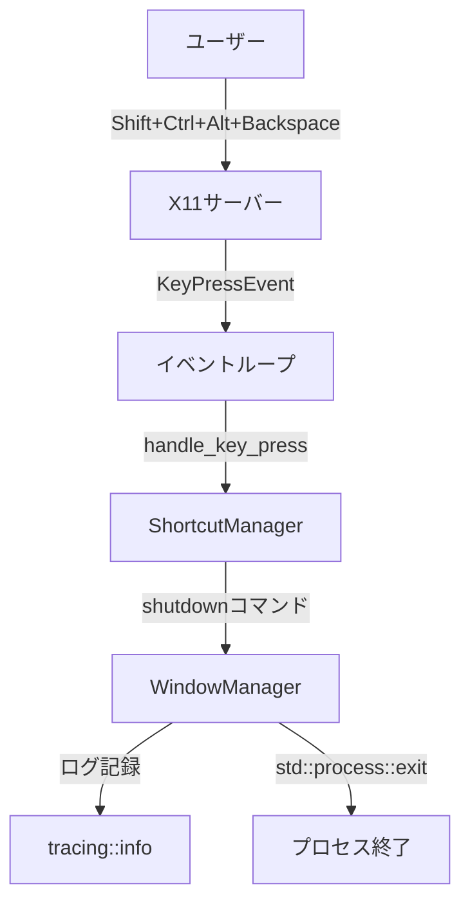
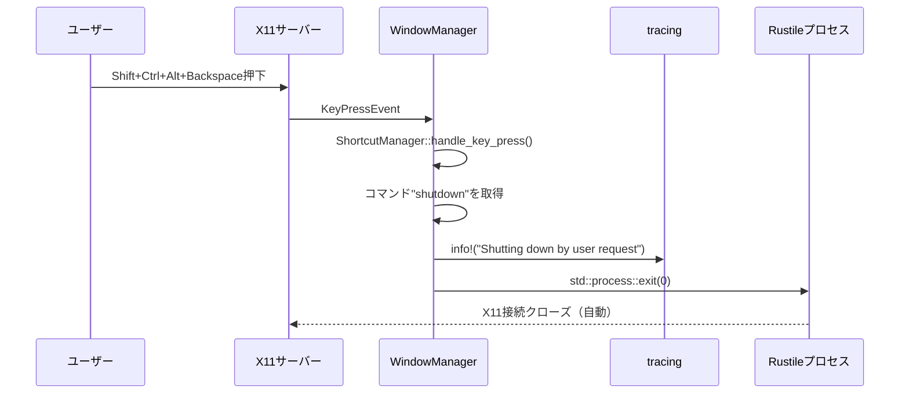

# 技術設計書: シャットダウンコマンド

## 概要

この機能は、Rustileウィンドウマネージャーにキーボードショートカットによるプロセス終了機能を追加する。ユーザーは設定ファイルで定義したキーコンビネーション（デフォルト: Shift+Ctrl+Alt+Backspace）を押すことで、ターミナルを開いて手動でプロセス終了コマンドを実行する手間なく、rustileを即座に終了できる。

**ユーザー**: Rustile開発者および利用者が、設定変更後の再起動や、ウィンドウマネージャーのみを終了したい場合に使用する。

**影響**: 既存のイベントループに終了ロジックを追加するのみで、他のコマンド処理や状態管理には影響を与えない。

### ゴール
- キーボードショートカットでrustileプロセスを即座に終了できる
- 既存のコマンドディスパッチシステムに統合し、他のコマンドと同等に扱う
- 設定ファイルでキーバインディングをカスタマイズ可能にする
- ログに終了理由を記録し、デバッグを容易にする

### 非ゴール
- 自動再起動機能（将来の拡張として検討）
- グレースフルシャットダウン（ウィンドウの保存、セッション復元など）
- 確認ダイアログの表示（誤操作防止は複雑なキーコンビネーションで対応）

## アーキテクチャ

### 既存アーキテクチャの分析

Rustileは以下のアーキテクチャパターンに従っている：

- **イベント駆動アーキテクチャ**: X11イベントループがコアで、各イベントをハンドラーにディスパッチ
- **コマンドパターン**: キー押下イベントは文字列コマンド（例: "focus_next", "destroy_window"）にマッピングされ、`WindowManager::handle_key_press()`でマッチング処理
- **責任分離**:
  - `ShortcutManager`: キーバインディング登録とイベントマッチング
  - `WindowManager`: コマンド実行とウィンドウ状態管理
  - `WorkspaceRenderer`: レイアウト計算とX11描画

この設計では、既存のコマンドディスパッチシステムを維持し、新しい"shutdown"コマンドを追加する。

### 高レベルアーキテクチャ



**アーキテクチャ統合**:
- 既存パターン維持: イベント駆動 + コマンドパターン
- 新規コンポーネント: なし（既存のWindowManagerにマッチケースを1つ追加）
- 技術スタック整合: 標準ライブラリ（std::process::exit）のみ使用、外部依存なし
- Steering準拠: 最小変更原則、既存コードの再利用

## 技術スタック整合

**既存技術スタックとの整合**:
- Rust標準ライブラリ: `std::process::exit(0)`を使用
- ログ: 既存の`tracing`クレートを使用（`info!`マクロ）
- 設定管理: 既存の`config.toml`およびTOMLパーサーを使用

**新規依存関係**: なし

**パターン準拠**: 既存のコマンドディスパッチパターンに従い、`WindowManager::handle_key_press()`内のmatchステートメントに新しいケースを追加

### 主要設計決定

#### 決定1: プロセス終了方法

**決定**: `std::process::exit(0)`を使用してプロセスを即座に終了する

**コンテキスト**: Rustileを終了する方法として、以下の選択肢がある：
1. イベントループを抜けて自然終了
2. `std::process::exit()`で即座に終了
3. シグナルを自身に送信（SIGTERM/SIGINT）

**代替案**:
- **イベントループフラグ**: `should_quit`フラグをWindowManagerに追加し、ループ条件で確認
- **シグナルベース**: `kill(getpid(), SIGTERM)`で自分自身にシグナルを送信
- **即座終了**: `std::process::exit(0)`を直接呼び出し

**選択アプローチ**: `std::process::exit(0)`による即座終了

**根拠**:
- シンプルさ: 追加の状態管理やフラグ不要
- 明確な意図: コマンド名"shutdown"と動作が一致
- ユーザー期待: キーを押したら即座に終了することを期待

**トレードオフ**:
- 獲得: コード変更最小、動作が明確、実装が簡単
- 犠牲: デストラクタ未実行（ただしRustileはX11リソース自動解放、実害なし）

## システムフロー

### シャットダウンシーケンス



## 要件トレーサビリティ

| 要件 | 要件概要 | コンポーネント | インターフェース | フロー |
|------|----------|----------------|------------------|--------|
| 1.1 | ショートカットでプロセス終了 | WindowManager | handle_key_press() | シャットダウンシーケンス |
| 1.2 | 即座に終了 | WindowManager | std::process::exit(0) | シャットダウンシーケンス |
| 1.3 | ログ記録 | WindowManager | tracing::info!() | シャットダウンシーケンス |
| 2.1 | config.toml認識 | ShortcutManager | register_shortcuts() | 既存の設定読み込みフロー |
| 2.2 | 異なるキーコンビネーション受容 | ShortcutManager | register_shortcuts() | 既存の設定読み込みフロー |
| 2.3 | config.exampleに例示 | Config | - | 設定ファイル |
| 3.1 | ログに終了理由記録 | WindowManager | tracing::info!() | シャットダウンシーケンス |
| 3.2 | 意図的操作として識別可能 | WindowManager | ログメッセージ"Shutting down by user request" | シャットダウンシーケンス |
| 4.1 | コマンドマッチング処理 | WindowManager | handle_key_press() | シャットダウンシーケンス |
| 4.2 | 適切な方法で終了 | WindowManager | std::process::exit(0) | シャットダウンシーケンス |
| 4.3 | 他のコマンドと同様に処理 | WindowManager | matchステートメント | シャットダウンシーケンス |

## コンポーネントとインターフェース

### ウィンドウ管理レイヤー

#### WindowManager

**責任と境界**
- **主要責任**: X11イベントをコマンドに変換し、実行する
- **ドメイン境界**: ウィンドウマネージャーコア（イベント処理、状態管理）
- **データ所有**: ワークスペース一覧、ショートカットマネージャー、現在のワークスペースインデックス
- **トランザクション境界**: 各イベント処理は独立（シャットダウンは即座にプロセス終了）

**依存関係**
- **インバウンド**: メインループ（`main.rs`）がイベントをディスパッチ
- **アウトバウンド**:
  - `ShortcutManager`: キー押下をコマンドに変換
  - `tracing`: ログ出力
  - `std::process`: プロセス終了
- **外部**: X11サーバー（x11rbクレート経由）

**契約定義**

**メソッド拡張**（既存メソッドに追加）:
```rust
impl<C: Connection> WindowManager<C> {
    fn handle_key_press(&mut self, event: KeyPressEvent) -> Result<()> {
        // 既存のコマンドマッチング処理...
        match command {
            // ... 既存のケース ...
            "shutdown" => {
                info!("Shutting down Rustile by user request");
                std::process::exit(0);
            }
            _ => { /* 既存の外部コマンド起動処理 */ }
        }
    }
}
```

- **事前条件**: KeyPressEventが有効なショートカットにマッチすること
- **事後条件**: "shutdown"コマンドの場合、ログ出力後にプロセスが終了する（正常終了コード0）
- **不変条件**: イベントループは終了するため、不変条件は適用外

**統合戦略**:
- **変更アプローチ**: 既存の`handle_key_press()`メソッドのmatchステートメントに1ケース追加
- **後方互換性**: 既存のコマンドには影響なし、新しいコマンドを追加するのみ
- **移行パス**: 設定ファイルに"shutdown"キーバインドを追加するだけ（オプション）

### 設定管理レイヤー

#### Config（既存コンポーネント）

**変更内容**: `config.example.toml`にデフォルトのシャットダウンキーバインド例を追加

```toml
# Rustile management
"Shift+Ctrl+Alt+Backspace" = "shutdown"  # Shutdown Rustile WM
```

**統合**: 既存の設定読み込みフローに変更なし（ShortcutManagerが自動認識）

## エラーハンドリング

### エラー戦略

シャットダウンコマンドは即座にプロセスを終了するため、エラー処理は最小限：

1. **ログ記録成功**: `info!`マクロでログ記録後、`exit(0)`を呼び出し
2. **ログ記録失敗**: tracingが失敗しても`exit(0)`は実行される（ログはベストエフォート）

### エラーカテゴリと対応

**システムエラー**:
- **ログ書き込み失敗**: 無視（ログ出力は補助的、終了処理は継続）

**ビジネスロジックエラー**: なし（シャットダウンは常に成功）

### モニタリング

- **ログ出力**: `~/.rustile.log`に`INFO`レベルで記録
- **ログフォーマット**: `Shutting down Rustile by user request`（意図的な終了と識別可能）
- **終了コード**: `0`（正常終了）

## テスト戦略

### ユニットテスト
1. **コマンド認識**: "shutdown"コマンドがWindowManagerのmatchステートメントで認識されることを確認（コンパイル時チェック）
2. **設定パース**: config.tomlに"Shift+Ctrl+Alt+Backspace" = "shutdown"が存在することを確認

### 統合テスト
1. **キーバインド登録**: ShortcutManagerが"shutdown"コマンドをX11に正しく登録することを確認
2. **イベントフロー**: KeyPressEvent → ShortcutManager → WindowManager のフローを確認（モックX11接続使用）

### 手動テスト（E2E）
1. **基本動作**: Rustile起動 → Shift+Ctrl+Alt+Backspace押下 → プロセス終了を確認
2. **ログ記録**: `~/.rustile.log`に"Shutting down Rustile by user request"が記録されることを確認
3. **カスタムキーバインド**: config.tomlで異なるキー（例: "Super+Shift+q"）に変更して動作確認

### 性能テスト
不要（シャットダウンは1回のみ実行、性能要件なし）
