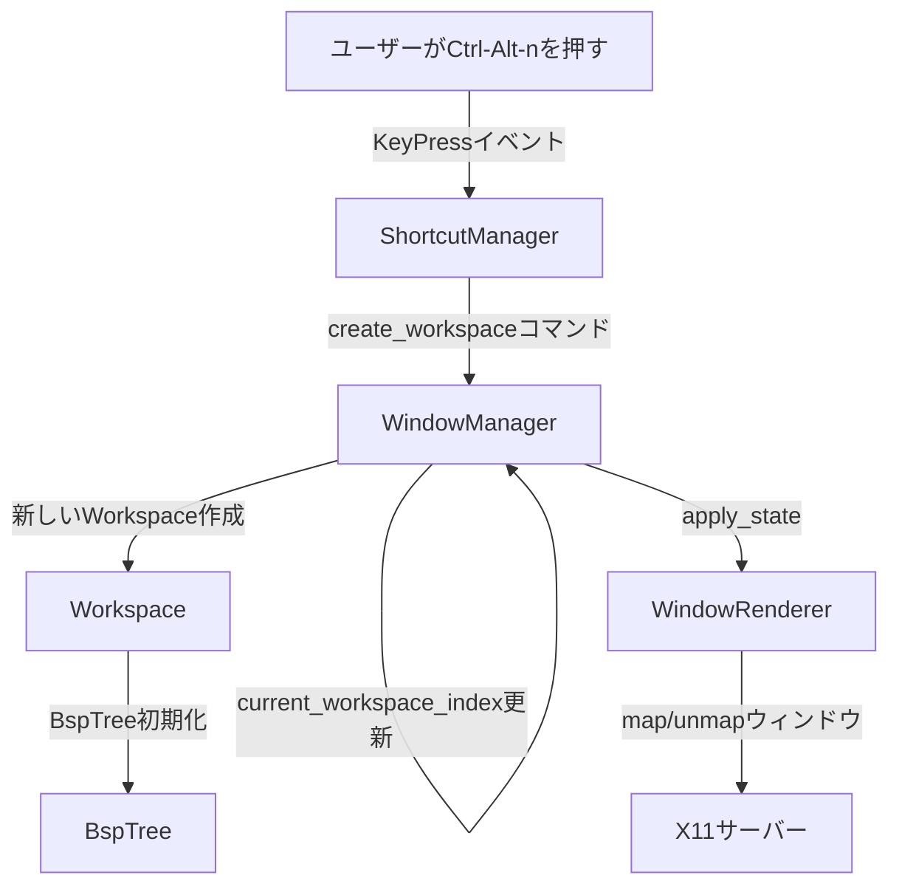
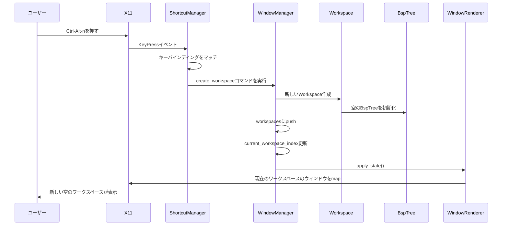
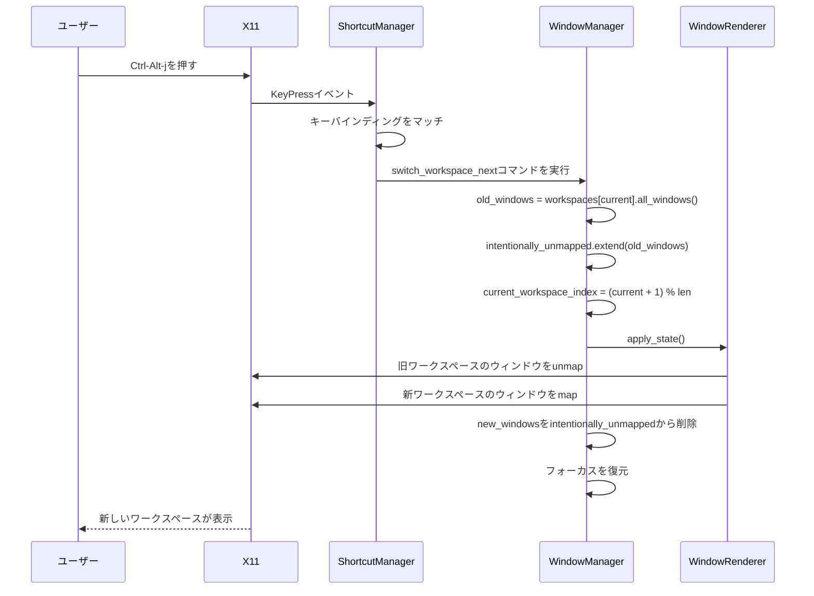
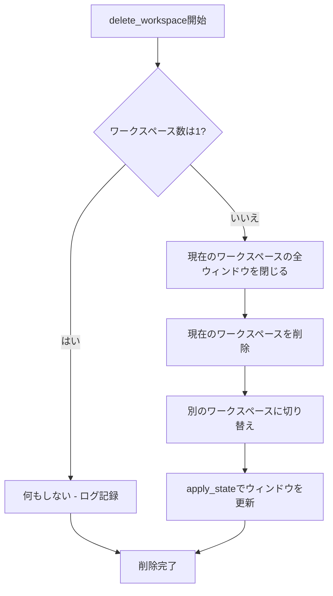

# 技術設計: ワークスペース管理

## 概要

ワークスペース管理機能は、単一物理ディスプレイ上で複数の独立した仮想デスクトップ環境を提供します。各ワークスペースは独自のBSPツリーを保持し、ユーザーはタスクやプロジェクトごとにウィンドウをグループ化できます。

**ユーザー**: ウィンドウマネージャーのユーザーは、複数のタスクやプロジェクトを同時に進めながら、コンテキストごとにウィンドウを整理するために利用します。

**影響**: 現在のWindowStateが単一BspTreeを保持する構造を、WindowManagerが複数のWorkspace（各々がBspTreeを持つ）を管理する構造に変更します。WindowStateの責任をWorkspace構造体に移行し、WindowManagerが直接ワークスペースを管理します。

### ゴール

- Ctrl-Alt-nでワークスペース作成、Ctrl-Alt-qでワークスペース削除
- Ctrl-Alt-j/kでワークスペース間の循環切り替え
- 各ワークスペースの独立したBSPツリーとウィンドウ状態の維持
- ワークスペース切り替え時のスムーズなウィンドウマップ/アンマップ

### 非ゴール

- ワークスペース番号による直接ジャンプ（将来の拡張として検討）
- ワークスペース間でのウィンドウ移動（将来の拡張として検討）
- ワークスペースの永続化（再起動時には単一ワークスペースから開始）
- ワークスペース固有の設定やレイアウト

## アーキテクチャ

### 既存アーキテクチャ分析

Rustileは以下の明確な責任分離を持つアーキテクチャを採用しています：

**WindowState** (`src/window_state.rs`): 単一BspTreeとフォーカス状態、fullscreen/zoom状態を管理します。ウィンドウレイアウトの単一の真実のソースとして機能します。

**BspTree** (`src/bsp.rs`): BSPノード構造とツリー操作を提供します。ウィンドウの追加、削除、交換、回転などの操作をX11呼び出しなしで実行します。

**WindowManager** (`src/window_manager.rs`): X11イベント処理とコマンドディスパッチを調整します。キーバインディングはWindowStateを変更してからWindowRenderer::apply_state()を呼び出すメソッドにマッピングされます。

**WindowRenderer** (`src/window_renderer.rs`): WindowStateをX11操作に変換します。BspTreeをトラバースしてconfigure_window呼び出しを発行するapply_state()を含みます。

**Config** (`src/config.rs`): TOMLベースの設定管理。キーバインディングはHashMap<String, String>として格納されます。

**ShortcutManager** (`src/keyboard.rs`): キーバインディング文字列を解析し、X11 keycodeに変換し、KeyPressイベントを処理します。

### ハイレベルアーキテクチャ



### 技術的整合性

既存のRust/X11スタックを拡張します：

**言語**: Rust（既存のコードベース標準）
**X11ライブラリ**: `x11rb`（すべてのウィンドウ操作に既に使用）
**設定**: `serde`および`toml` crateを介したTOML（既存の設定システム）
**ログ**: `tracing` crate（既存のログインフラストラクチャ）

**新規コンポーネント**:
- `Workspace`構造体 - 単一ワークスペースの状態をカプセル化（WindowStateから抽出）

**既存コンポーネントの変更**:
- `WindowManager` - Vec<Workspace>を保持、ワークスペース操作コマンドを追加
- `WindowState` - Workspace構造体に機能を移行し、削除または大幅簡素化
- `WindowRenderer` - ワークスペース切り替え時のmap/unmap処理を追加

### 重要な設計決定

#### 決定1: WindowManagerが直接Vec<Workspace>を管理

**コンテキスト**: 複数のワークスペースを管理し、各ワークスペースが独立した状態を維持する必要があります。既存のWindowStateは既にワークスペース相当の状態（BspTree、フォーカス、fullscreen/zoom）を保持しています。

**代替案**:
1. WorkspaceManager構造体で管理をカプセル化
2. WindowManagerがVec<Workspace>を直接管理
3. 各Workspaceを独立したWindowStateとして扱う（メモリ重複あり）

**選択したアプローチ**: WindowManagerがVec<Workspace>とcurrent_workspace_indexを直接保持します。Workspace構造体はWindowStateからワークスペース固有の状態（BspTree、フォーカス、fullscreen/zoom）を抽出したものです。

**理論的根拠**:
- 概念的明確さ: WindowState ≒ Workspace、余分な抽象層が不要
- コード変更の最小化: WindowStateからWorkspaceへの構造体リネームと移行のみ
- メモリ効率: config、screen_numなどの共通状態を重複せずWindowManagerに保持
- 既存パターンの維持: WindowManagerがコンポーネントを所有する既存設計を踏襲
- シンプルなアクセス: `self.workspaces[self.current_workspace_index]`で直接アクセス

**トレードオフ**:
- 利点: シンプルな構造、最小限の変更、メモリ効率、概念的明確さ
- 欠点: WindowManagerがワークスペース管理ロジックを直接持つ（肥大化のリスク）

#### 決定2: intentionally_unmappedの配置

**コンテキスト**: fullscreenモードやワークスペース切り替え時に、WMが意図的にunmapしたウィンドウと、ユーザーが閉じたウィンドウを区別する必要があります。

**代替案**:
1. 各Workspaceに保持
2. WindowManagerに全ワークスペース共通で保持
3. 新しいグローバル状態管理構造体に保持

**選択したアプローチ**: WindowManagerに全ワークスペース共通のintentionally_unmapped: HashSet<Window>を保持します。

**理論的根拠**:
- UnmapNotifyイベントはどのワークスペースのウィンドウでも発生する
- 非アクティブなワークスペースのウィンドウに対してもイベント処理が必要
- 既存のfullscreenモードも全ワークスペースで共通の状態として扱う
- イベント処理の簡素化: 1つのセットをチェックするだけ

**トレードオフ**:
- 利点: 正確なイベント処理、実装のシンプルさ、既存パターンとの一貫性
- 欠点: なし（これが唯一の正しいアプローチ）

#### 決定3: 最後のワークスペース削除時の動作

**コンテキスト**: ユーザーが最後（唯一）のワークスペースを削除しようとした場合の動作を決定する必要があります。

**代替案**:
1. 削除を拒否してno-op（何もしない）
2. ワークスペースを削除してアプリケーションを終了
3. 新しい空のワークスペースを自動作成

**選択したアプローチ**: 削除を拒否してno-op（ログ記録のみ）とします。

**理論的根拠**:
- 一貫性: 常に少なくとも1つのワークスペースが存在
- 予測可能性: ユーザーは意図せずすべてを失わない
- シンプルさ: エッジケース処理が不要
- 標準的な動作: 多くのWMが同様の動作を採用

**トレードオフ**:
- 利点: 予測可能な動作、データ損失なし、実装のシンプルさ
- 欠点: ユーザーが「削除できない」と感じる可能性（ただしログで説明）

## システムフロー

### ワークスペース作成フロー



### ワークスペース切り替えフロー



### ワークスペース削除フロー



## 要件トレーサビリティ

| 要件 | 概要 | コンポーネント | インターフェース | フロー |
|------|------|--------------|----------------|--------|
| 1.1-1.5 | ワークスペース作成 | WindowManager, Workspace | create_workspace(), apply_state() | ワークスペース作成フロー |
| 2.1-2.5 | ワークスペース削除 | WindowManager | delete_workspace(), destroy_window() | ワークスペース削除フロー |
| 3.1-3.7 | ワークスペース切り替え | WindowManager | switch_workspace_next(), switch_workspace_prev() | ワークスペース切り替えフロー |
| 4.1-4.5 | ワークスペース状態管理 | Workspace, WindowManager | Workspace構造体、Vec操作 | すべてのフロー |
| 5.1-5.4 | キーバインディング設定 | Config, ShortcutManager | shortcuts HashMap, register_shortcuts() | すべてのフロー |
| 6.1-6.4 | ウィンドウ表示制御 | WindowRenderer, WindowManager | apply_state(), map/unmap操作 | ワークスペース切り替えフロー |
| 7.1-7.2 | パフォーマンスと制約 | WindowManager | メモリ効率的なVec<Workspace> | N/A |
| 8.1-8.5 | テストと検証 | テストモジュール | #[cfg(test)]セクションのユニットテスト | N/A |
| 9.1-9.4 | 後方互換性 | 全コンポーネント | 新しいコマンド追加のみ | N/A |

## コンポーネントとインターフェース

### ワークスペース管理ドメイン

#### Workspace

**責任と境界**
- **主要な責任**: 単一ワークスペースの状態（BspTree、フォーカス、fullscreen/zoom状態）をカプセル化
- **ドメイン境界**: ワークスペース状態管理
- **データ所有権**: BspTree、フォーカス状態、fullscreen/zoom状態を所有
- **トランザクション境界**: 単一スレッド、X11イベントループがシーケンスを処理

**依存関係**
- **Inbound**: WindowManager（状態の取得と更新）
- **Outbound**: BspTree（ウィンドウ操作）
- **外部**: なし

**契約定義**

```rust
/// 単一ワークスペースの状態を表す
pub struct Workspace {
    bsp_tree: BspTree,
    focused_window: Option<Window>,
    fullscreen_window: Option<Window>,
    zoomed_window: Option<Window>,
}

impl Workspace {
    /// 新しい空のワークスペースを作成
    ///
    /// # 事後条件
    /// - 空のBspTreeが初期化される
    /// - すべてのウィンドウ状態がNone
    pub fn new() -> Self;

    /// BspTreeへの参照を取得
    pub fn bsp_tree(&self) -> &BspTree;

    /// BspTreeへの可変参照を取得
    pub fn bsp_tree_mut(&mut self) -> &mut BspTree;

    /// フォーカス状態の取得と設定
    pub fn focused_window(&self) -> Option<Window>;
    pub fn set_focused_window(&mut self, window: Option<Window>);

    /// fullscreen状態の取得と設定
    pub fn fullscreen_window(&self) -> Option<Window>;
    pub fn set_fullscreen_window(&mut self, window: Option<Window>);

    /// zoom状態の取得と設定
    pub fn zoomed_window(&self) -> Option<Window>;
    pub fn set_zoomed_window(&mut self, window: Option<Window>);

    /// すべてのウィンドウを取得
    pub fn all_windows(&self) -> Vec<Window>;

    /// ウィンドウをレイアウトに追加
    pub fn add_window(&mut self, window: Window, split_ratio: f32);

    /// ウィンドウをレイアウトから削除
    pub fn remove_window(&mut self, window: Window);

    // ... その他の既存WindowStateメソッドをWorkspaceに移植
}
```

**状態管理**
- **状態モデル**: ステートフル - 状態はフィールドに保持
- **永続性**: なし（一時的、再起動時に再作成）
- **並行性**: 該当なし（シングルスレッドX11イベントループ）

**統合戦略**
- **変更アプローチ**: WindowStateからワークスペース固有の状態を抽出してWorkspace構造体に移動
- **後方互換性**: 既存のpublic APIメソッドをWorkspaceに移植
- **移行パス**: WindowStateの呼び出しをWindowManager経由でWorkspaceに変更

### ウィンドウ管理ドメイン

#### WindowManager（拡張）

**責任と境界**
- **主要な責任**: 複数のワークスペースを管理し、X11イベント処理とコマンドディスパッチを調整
- **ドメイン境界**: ワークスペースコレクション管理とイベントオーケストレーション
- **データ所有権**: Vec<Workspace>、current_workspace_index、intentionally_unmapped、configを所有
- **トランザクション境界**: 単一のコマンド実行（ワークスペース操作 + レンダリング）

**依存関係**
- **Inbound**: ShortcutManager（キーバインディングマッチ経由）、X11イベント
- **Outbound**: Workspace（ワークスペース状態）、WindowRenderer（apply_state）
- **外部**: x11rb Connection

**契約定義**

```rust
pub struct WindowManager<C: Connection> {
    conn: C,
    shortcut_manager: ShortcutManager,
    workspaces: Vec<Workspace>,
    current_workspace_index: usize,
    intentionally_unmapped: HashSet<Window>,
    config: Config,
    screen_num: usize,
    window_renderer: WindowRenderer,
}

impl<C: Connection> WindowManager<C> {
    /// 新しいワークスペースを作成して切り替え
    ///
    /// # エラー
    /// apply_state中にX11操作が失敗した場合にエラーを返す
    ///
    /// # 副作用
    /// - 新しいワークスペースを作成
    /// - current_workspace_indexを更新
    /// - X11 map/unmap呼び出しを発行
    /// - ワークスペース作成をログ
    pub fn create_workspace(&mut self) -> Result<()>;

    /// 現在のワークスペースを削除
    ///
    /// # 事前条件
    /// - workspaces.len() > 1（1つしかない場合はno-op）
    ///
    /// # エラー
    /// apply_state中にX11操作が失敗した場合にエラーを返す
    ///
    /// # 副作用
    /// - workspaces.len() == 1の場合、何もせずログのみ
    /// - workspaces.len() > 1の場合、現在のワークスペースの全ウィンドウを閉じる
    /// - ワークスペースを削除して別のワークスペースに切り替え
    /// - X11 destroy_window呼び出しを発行
    /// - ワークスペース削除をログ
    pub fn delete_workspace(&mut self) -> Result<()>;

    /// 次のワークスペースに切り替え
    ///
    /// # エラー
    /// apply_state中にX11操作が失敗した場合にエラーを返す
    ///
    /// # 副作用
    /// - current_workspace_indexを更新（循環）
    /// - 旧ワークスペースのウィンドウをintentionally_unmappedに追加
    /// - X11 map/unmap呼び出しを発行
    /// - 新ワークスペースのウィンドウをintentionally_unmappedから削除
    /// - フォーカスを復元
    /// - ワークスペース切り替えをログ
    pub fn switch_workspace_next(&mut self) -> Result<()>;

    /// 前のワークスペースに切り替え
    ///
    /// # エラー
    /// apply_state中にX11操作が失敗した場合にエラーを返す
    ///
    /// # 副作用
    /// - current_workspace_indexを更新（循環）
    /// - 旧ワークスペースのウィンドウをintentionally_unmappedに追加
    /// - X11 map/unmap呼び出しを発行
    /// - 新ワークスペースのウィンドウをintentionally_unmappedから削除
    /// - フォーカスを復元
    /// - ワークスペース切り替えをログ
    pub fn switch_workspace_prev(&mut self) -> Result<()>;

    /// 現在のワークスペースへの参照を取得
    fn current_workspace(&self) -> &Workspace;

    /// 現在のワークスペースへの可変参照を取得
    fn current_workspace_mut(&mut self) -> &mut Workspace;
}
```

**統合戦略**
- **変更アプローチ**: window_state: WindowStateをworkspaces: Vec<Workspace>に置き換え
- **後方互換性**: 新しいメソッド追加、既存のイベントハンドラは内部実装のみ変更
- **移行パス**: WindowStateへのアクセスをcurrent_workspace()経由に変更

#### WindowRenderer（拡張）

**責任と境界**
- **主要な責任**: ワークスペース切り替え時にウィンドウをmap/unmapする
- **ドメイン境界**: X11レンダリング操作
- **データ所有権**: 状態を所有しない、Workspaceを読み取る
- **トランザクション境界**: 単一のapply_state操作

**依存関係**
- **Inbound**: WindowManager（apply_state呼び出し）
- **Outbound**: X11 Connection（map/unmap呼び出し）
- **外部**: x11rb crate

**契約定義**

```rust
impl WindowRenderer {
    /// ワークスペースのウィンドウをマップ
    ///
    /// # エラー
    /// X11操作が失敗した場合にエラーを返す
    ///
    /// # 副作用
    /// - 各ウィンドウにmap_window呼び出しを発行
    pub fn map_workspace_windows<C: Connection>(
        &self,
        conn: &C,
        windows: &[Window],
    ) -> Result<()>;

    /// ワークスペースのウィンドウをアンマップ
    ///
    /// # エラー
    /// X11操作が失敗した場合にエラーを返す
    ///
    /// # 副作用
    /// - 各ウィンドウにunmap_window呼び出しを発行
    pub fn unmap_workspace_windows<C: Connection>(
    &self,
        conn: &C,
        windows: &[Window],
    ) -> Result<()>;
}
```

**統合戦略**
- **変更アプローチ**: 既存のapply_state()にワークスペースmap/unmap処理を追加
- **後方互換性**: 新しいヘルパーメソッド、既存のapply_state()シグネチャは変更なし
- **移行パス**: ワークスペース切り替え時にのみ新しいメソッドを呼び出す

### 設定ドメイン

#### Config（拡張）

**責任と境界**
- **主要な責任**: ワークスペースキーバインディング設定の保存
- **ドメイン境界**: 設定管理
- **データ所有権**: キーバインディングHashMapを所有
- **トランザクション境界**: 起動時の設定ロード

**依存関係**
- **Inbound**: WindowManager（起動時に設定を読む）
- **Outbound**: なし
- **外部**: TOMLパーサー（`toml` crate）、ファイルシステム

**契約定義**

**設定スキーマ拡張**:
```toml
[shortcuts]
# 既存のショートカット
"Alt+j" = "focus_next"
"Alt+k" = "focus_prev"
# ... その他のショートカット ...

# 新しいワークスペースキーバインディング（オプション - 省略した場合、デフォルトを使用）
"Ctrl-Alt+n" = "create_workspace"
"Ctrl-Alt+q" = "delete_workspace"
"Ctrl-Alt+j" = "switch_workspace_next"
"Ctrl-Alt+k" = "switch_workspace_prev"
```

**検証ルール**:
- キーバインディング文字列は`ShortcutManager::parse_key_combination()`で正常に解析される必要がある
- コマンド値は空でない文字列である必要がある
- ワークスペースコマンドに特別な検証は不要（ディスパッチロジックで処理）

**統合戦略**
- **変更アプローチ**: コード変更不要 - 既存の`HashMap<String, String>`が任意のコマンドをサポート
- **後方互換性**: 完全に互換 - キーバインディングなしのユーザーは通常通り動作し続ける
- **移行パス**: ユーザーはconfig.tomlにキーバインディングを追加して機能を有効化

## データモデル

### ドメインモデル

**コアコンセプト**:

**Workspace**: 単一ワークスペースの状態を表す
- `bsp_tree: BspTree` - ウィンドウレイアウト
- `focused_window: Option<Window>` - フォーカス状態
- `fullscreen_window: Option<Window>` - fullscreen状態
- `zoomed_window: Option<Window>` - zoom状態

**WindowManager**: ワークスペースのコレクションと共通状態を管理
- `workspaces: Vec<Workspace>` - すべてのワークスペース
- `current_workspace_index: usize` - アクティブなワークスペースのインデックス
- `intentionally_unmapped: HashSet<Window>` - 全ワークスペース共通の意図的unmapセット
- `config: Config` - 全ワークスペース共通の設定
- `screen_num: usize` - 画面番号

**ビジネスルールと不変条件**:
- 常に少なくとも1つのワークスペースが存在する必要がある（起動時に作成）
- current_workspace_indexは有効なワークスペースを指す必要がある（0 <= current_workspace_index < workspaces.len()）
- 各ワークスペースのBspTreeは独立している必要がある
- ワークスペース削除時に、そのワークスペースのすべてのウィンドウを閉じる必要がある
- intentionally_unmappedは全ワークスペースで共有される（どのワークスペースのウィンドウでも追跡）

### データフロー

**ワークスペース作成時のデータフロー**:
```
ユーザー入力 → ShortcutManager → WindowManager
  ↓
Workspace::new() → BspTree::new()
  ↓
workspaces.push(workspace)
  ↓
current_workspace_index = workspaces.len() - 1
  ↓
WindowRenderer::apply_state() → X11 map/unmap
```

**ワークスペース切り替え時のデータフロー**:
```
ユーザー入力 → ShortcutManager → WindowManager
  ↓
old_windows = workspaces[current_workspace_index].all_windows()
  ↓
intentionally_unmapped.extend(old_windows)
  ↓
current_workspace_index = (current_workspace_index + 1) % workspaces.len()
  ↓
new_windows = workspaces[current_workspace_index].all_windows()
  ↓
WindowRenderer::unmap_workspace_windows(old_windows)
WindowRenderer::map_workspace_windows(new_windows)
  ↓
intentionally_unmapped.remove(new_windows)
  ↓
フォーカス復元
```

## エラー処理

### エラー戦略

ワークスペース操作はRustの`Result<()>`戻り値型を使用して、X11操作からのエラーを伝播します。ワークスペース管理ロジック自体は失敗しません（不変条件で保護）。

### エラーカテゴリと対応

**X11プロトコルエラー**（5xx相当）:
- `map_window`/`unmap_window`失敗 → エラーをログ、残りのウィンドウで継続を試みる
- `destroy_window`失敗 → エラーをログ、次のウィンドウで継続
- 接続切断 → イベントループにエラーを伝播（再起動/終了をトリガー）

**無効な状態エラー**（設計により防止）:
- 空のワークスペースリスト → 不可能（起動時に少なくとも1つ作成、削除はno-op）
- 無効なcurrent_workspace_index → 不可能（switch操作で循環インデックス使用）
- 最後のワークスペース削除 → no-op（削除せずログのみ）

### エラー回復

**X11操作の失敗**:
```rust
// WindowRenderer::map_workspace_windows()内
for window in windows {
    if let Err(e) = conn.map_window(*window) {
        error!("Failed to map window {:?}: {}", window, e);
        // 残りのウィンドウで継続 - 部分的な成功は完全な失敗より良い
        continue;
    }
}
```

**ワークスペース削除時のウィンドウクローズ失敗**:
```rust
// WindowManager::delete_workspace()内
if self.workspaces.len() == 1 {
    info!("Cannot delete last workspace, ignoring");
    return Ok(());
}

let windows = self.workspaces[self.current_workspace_index].all_windows();
for window in windows {
    if let Err(e) = self.destroy_window(window) {
        error!("Failed to destroy window {:?}: {}", window, e);
        // 次のウィンドウで継続
        continue;
    }
}
// ワークスペース削除は続行（ウィンドウクローズ失敗に関わらず）
```

### 監視

**ログ戦略**:
- `info!` - 成功したワークスペース操作（作成、削除、切り替え）
- `info!` - 最後のワークスペース削除試行時のno-op
- `error!` - X11操作の失敗、ウィンドウクローズの失敗

## テスト戦略

### ユニットテスト

**Workspace構造体**（`src/workspace.rs`）:
1. `test_workspace_creation` - 新しいワークスペースが空のBspTreeで作成されることを検証
2. `test_workspace_window_operations` - ウィンドウの追加、削除、クエリを検証
3. `test_workspace_focus_management` - フォーカス状態の取得と設定を検証
4. `test_workspace_state_isolation` - 各ワークスペースの状態が独立していることを検証

**WindowManager**（`src/window_manager.rs`）:
1. `test_window_manager_initialization` - 単一ワークスペースで初期化されることを検証
2. `test_create_workspace` - 新しいワークスペースが作成されて切り替わることを検証
3. `test_delete_workspace_multiple` - 複数ワークスペース時の削除を検証
4. `test_delete_workspace_last` - 最後のワークスペース削除がno-opであることを検証
5. `test_switch_next` - 次への切り替えと循環を検証
6. `test_switch_prev` - 前への切り替えと循環を検証
7. `test_intentionally_unmapped_tracking` - ワークスペース切り替え時のtrackingを検証

### 手動テスト（統合テストを兼ねる）

**キーバインディングからワークスペース操作までのフルフロー**:
1. ワークスペースキーバインディングを含む設定をロード
2. Rustileを起動（単一ワークスペースで開始）
3. Ctrl-Alt-nで新しいワークスペースを作成
4. 各ワークスペースに異なるウィンドウを開く
5. Ctrl-Alt-j/kでワークスペース間を切り替え
6. 正しいウィンドウセットが表示されることを目視確認
7. ワークスペース間でウィンドウ状態が独立していることを確認（フォーカス、レイアウト）
8. Ctrl-Alt-qでワークスペースを削除
9. 最後のワークスペース削除時にno-opであることを確認（ログ確認）
10. ワークスペース切り替え時にintentionally_unmappedが正しく動作することを確認（ウィンドウが消えない）

## パフォーマンスとスケーラビリティ

### 設計目標

| 項目 | 目標 | 説明 |
|---------|--------|------|
| メモリ割り当て | ワークスペースごとに1つのWorkspace構造体 | O(n) n = ワークスペース数 |
| X11 map/unmap呼び出し | ワークスペースあたりM回 | M = ワークスペース内のウィンドウ数 |
| ワークスペース切り替え | O(M1 + M2) | M1 = 旧ワークスペースのウィンドウ数、M2 = 新ワークスペースのウィンドウ数 |

### スケーリングアプローチ

**メモリ効率**:
- ワークスペースはVec<Workspace>に格納（連続メモリ、キャッシュ効率）
- 各WorkspaceはBspTreeを所有（最小限のオーバーヘッド）
- config、screen_numなどの共通状態はWindowManagerに1つだけ保持（重複なし）
- 不要なクローンを避ける（参照を使用）

**X11操作のバッチ処理**:
- 既存のapply_state()は既にジオメトリ計算をバッチ処理
- map/unmap操作も同様にバッチ処理（ループ内で順次実行）
- 追加のバッチ処理不要 - 既存のインフラストラクチャを活用

### アルゴリズム計算量

**時間計算量**:
- `create_workspace()`: O(1) - Workspaceの作成とVecへの追加
- `delete_workspace()`: O(M + N) - M個のウィンドウを閉じ、Vecから削除（O(N) N = ワークスペース数）
- `switch_workspace_next()`/`switch_workspace_prev()`: O(1) - インデックスの更新のみ
- ワークスペース切り替え全体: O(M1 + M2) - map/unmap操作

**空間計算量**:
- O(W * M) - W = ワークスペース数、M = ワークスペースあたりの平均ウィンドウ数
- 各Workspaceは独立したBspTreeを所有
- intentionally_unmappedセットは全ワークスペース共通（O(M_active)）
