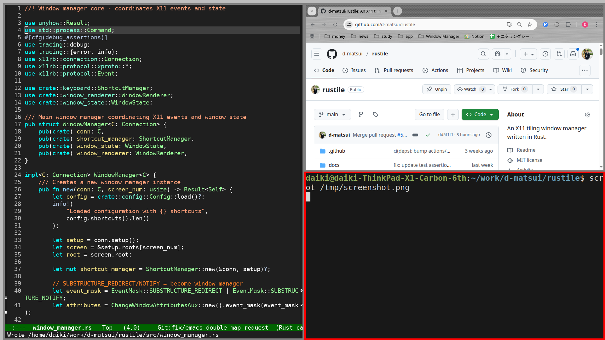

# Rustile

An X11 tiling window manager written in Rust, inspired by [yabai](https://github.com/koekeishiya/yabai) and [xpywm](https://github.com/h-ohsaki/xpywm).




## Key Features

- **Automatic Window Tiling** - BSP (Binary Space Partitioning) layout with no manual arrangement needed
- **Keyboard-Driven Workflow** - Full control without mouse dependency
- **Simple TOML Configuration** - Intuitive, readable config files with live validation

## Requirements

### Runtime Requirements
- **X11 display server** (Wayland/XWayland not supported)
- Linux system (tested on Ubuntu 24.04)

### Build Requirements (if building from source)
- Rust toolchain (rustc, cargo)
- X11 development libraries (libx11-dev, libxcb1-dev)

## Installation

### Option 1: Download Pre-built Binary

Download the latest release from [GitHub Releases](https://github.com/d-matsui/rustile/releases):

```bash
# Download and install (example for latest release)
wget https://github.com/d-matsui/rustile/releases/download/v1.0.0/rustile-v1.0.0-x86_64-linux.tar.gz
tar xzf rustile-v1.0.0-x86_64-linux.tar.gz
sudo cp rustile /usr/local/bin/
sudo chmod +x /usr/local/bin/rustile
```

### Option 2: Build from Source

```bash
# Install build dependencies (Debian/Ubuntu)
sudo apt-get install build-essential libx11-dev libxcb1-dev

# Clone and build
git clone https://github.com/d-matsui/rustile.git
cd rustile
cargo build --release

# Install binary
sudo cp target/release/rustile /usr/local/bin/
sudo chmod +x /usr/local/bin/rustile
```

## Quick Start - Try Rustile Safely

### Option 1: Xephyr (Recommended - Keep your desktop running)

The safest way to try Rustile without affecting your current desktop:

```bash
# Install Xephyr if needed
sudo apt-get install xserver-xephyr

# Create a nested X server window
Xephyr :10 -screen 1280x720 -resizeable &

# Start Rustile in the nested display
DISPLAY=:10 rustile &

# Launch some test applications
DISPLAY=:10 xterm &
DISPLAY=:10 xcalc &
```

To stop: Simply close the Xephyr window.

### Option 2: TTY Console (Advanced users)

Run Rustile on a different TTY while keeping your desktop session:

```bash
# Switch to TTY3 with Ctrl+Alt+F3 (TTY1/2 are often in use)
# Login with your username and password

# Using xinitrc
echo 'exec rustile > ~/.rustile.log 2>&1' > ~/.xinitrc
startx -- :10

# Switch between sessions:
# - Ctrl+Alt+F1 or F2: Back to your display manager/GNOME
# - Ctrl+Alt+F3: Back to Rustile session
```
To stop the session:
1. Switch to another TTY (e.g., Ctrl+Alt+F4)
2. Login and run: `killall Xorg`
3. Return to your main session (Ctrl+Alt+F1 or F2)


## Usage

### Keyboard Shortcuts

Default shortcuts are configured in `config.example.toml`. Key bindings include:
- **Navigation**: `Alt+j/k` (focus next/previous)
- **Window management**: `Shift+Alt+q` (close), `Alt+f` (fullscreen), `Alt+r` (rotate)
- **Applications**: `Shift+Alt+1/2/3` (terminal/editor/browser)

See [config.example.toml](config.example.toml) for the complete list.


## Production Setup

### Make Rustile Your Default Window Manager

Once you're comfortable with Rustile, choose one of these methods:

#### Option 1: Primary Window Manager (Minimal Environment)

**Best for**: Minimal systems or replacing other window managers

```bash
# Setup Rustile as default

# Create xinitrc
echo 'exec rustile > ~/.rustile.log 2>&1' > ~/.xinitrc

# Start X session
startx
```

**Note**: For input methods (IME), see [ADR-013: IME Setup](docs/adr/013-ime-setup-tty-environment.md) - configuration differs from running alongside desktop environments.

#### Option 2: Dedicated TTY (Alongside Desktop Environment)

**Best for**: Using Rustile alongside GNOME/KDE without conflicts

**Step 1: Setup TTY3 auto-login**
```bash
sudo systemctl edit getty@tty3.service
```
Add this configuration:
```ini
[Service]
ExecStart=
ExecStart=-/sbin/agetty --autologin USERNAME --noclear %I $TERM
```
Replace `USERNAME` with your actual username.

**Step 2: No additional config needed**
Rustile works out-of-the-box without configuration files.

**Step 3: Setup X auto-start on TTY3**
```bash
# Add to ~/.bash_profile (create if it doesn't exist)
cat >> ~/.bash_profile << 'EOF'

# TTY3 Rustile auto-start
if [ "$(tty)" = "/dev/tty3" ]; then
    exec startx -- :10
fi
EOF
```

**Step 4: Setup xinitrc for Rustile**
```bash
echo 'exec rustile > ~/.rustile.log 2>&1' > ~/.xinitrc
```

**Note**: For Japanese input (or other input methods), you'll need additional configuration in `.xinitrc`. See [ADR-013: IME Setup](docs/adr/013-ime-setup-tty-environment.md) for fcitx5/DBus configuration.

**Usage:**
- **Ctrl+Alt+F3**: Switch to Rustile environment
- **Ctrl+Alt+F1/F2**: Return to your main desktop (GNOME/KDE)
- Auto-login and X startup on TTY3

## Debugging & Troubleshooting

### Enable Logging

```bash
# View debug output
# Log levels: error, warn, info, debug, trace
RUST_LOG=debug rustile 2>&1 | tee rustile.log

```

## Documentation

- **[How Rustile Works](docs/HOW_RUSTILE_WORKS.md)** - Architecture, X11 concepts, event flow
- **[Roadmap](docs/ROADMAP.md)** - Planned features and development timeline
- **[Architecture Decision Records](docs/adr/)** - Design decisions and rationale

## License

MIT License - see [LICENSE](LICENSE) file for details.
